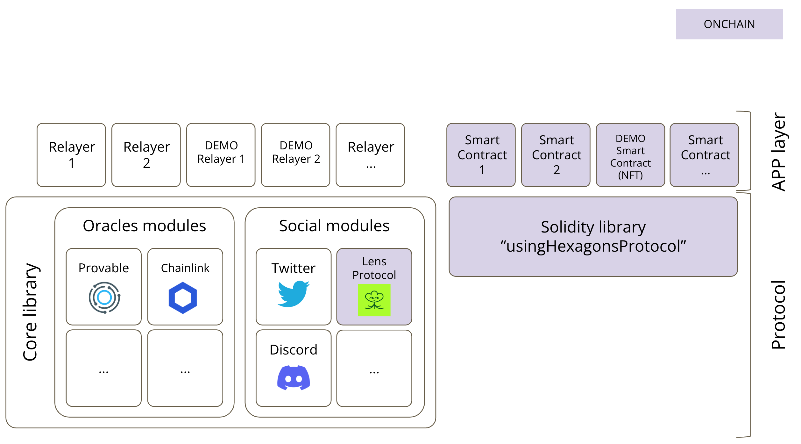

# Hexagons Protocol

A framework to build social-media driven smart contracts. Using the Hexagons Protocol you can build apps to make specially-crafted Posts trigger smart contract actions.


&nbsp;

***

&nbsp;

## :rocket: How to use it?

```
pragma solidity ^0.8.10;

import {UsingHexagons} from "@hexagons-protocol/UsingHexagons.sol";

contract YourContract is UsingHexagons {
    
    function _onHexagonsProtocolMessage(
        uint256 _protocolId,
        address _author,
        bytes calldata _data
    ) internal override {
        ...
    }
}
```

&nbsp;

***

&nbsp;

## :wrench: Architecture

